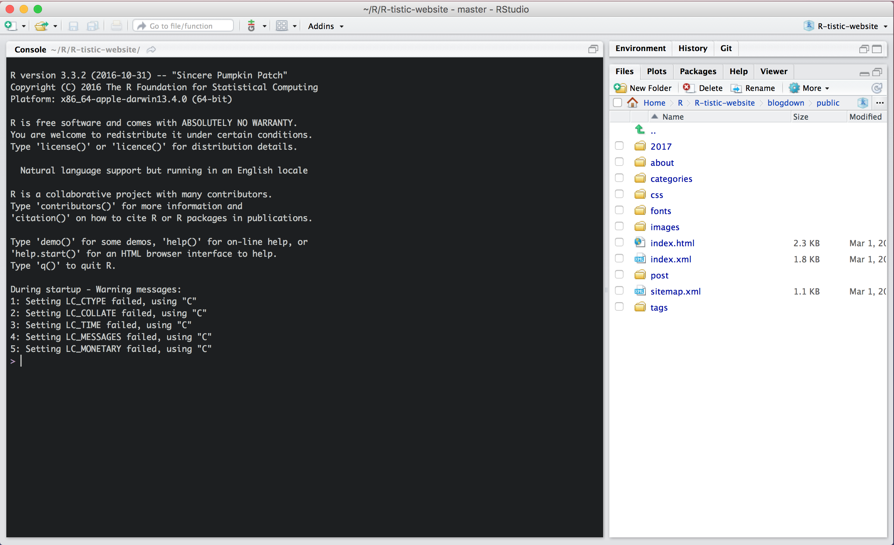
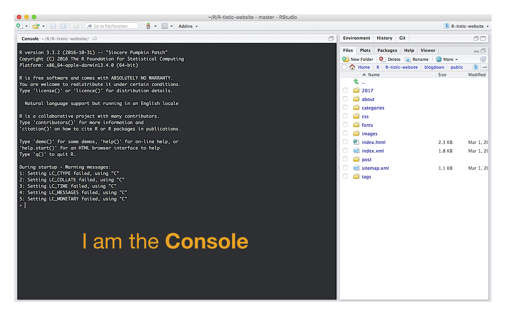

```{r setup, include=FALSE}

options(htmltools.dir.version = FALSE)
library(tidyverse)
library(knitr)
library(grDevices)
library(Cairo)

## print slides as PDF document

# system("~/decktape-1.0.0/phantomjs ~/decktape-1.0.0/decktape.js ~/R/R-tistic/aCourses/00-preparation-slides.html ~/R/R-tistic/aCourses/00-preparation-slides.pdf")

```

```{r download-remark-bib, include=FALSE}

# xaringan::summon_remark(version = "latest", to = "remark-lib/")

```

```{r make-pdf, message=FALSE, warning=FALSE, include=FALSE}

# system("~/decktape-1.0.0/phantomjs ~/decktape-1.0.0/decktape.js ~/R/R-tistic/aCourses/01-introduction-slides.html ~/R/R-tistic/aCourses/01-introduction-slides.pdf")

#system("~/decktape-1.0.0/phantomjs ~/decktape-1.0.0/decktape.js ~/slides/sanitation-systems-factsheets-slides.html ~/slides/sanitation-systems-factsheets-slides.pdf")

```

layout: true
class: theme

---

# Getting started
***
## Download and install R

* Go to http://www.r-project.org
* Download R for your operating system
* Install R
* Yes, even if you have already done that before


---

# Getting started
***
## Download and install RStudio

* Go to https://www.rstudio.com
* Download RStudio for your operating system
* Install RStudio
* Again, yes, even if you have already done that before

---

# Getting started
***
## Open RStudio 

- open RStudio


---
# Getting started
***
## Open RStudio 



---
# Getting started
***
## Find the Console



---
# Getting started
***
## Write your first line of code

- type `print("hello world")` into the **Console** and hit `↵`

--

Output:
```{r tidy=FALSE}
print("hello world")
```

--

Congrats! You have just written your first R code.

---
# Getting started
***
## Install packages 

- type `install.packages("tidyverse")` into the **Console**
    - this installs the R packages: `ggplot2`, `tibble`, `tidyr`, `readr`, `purrr` and `dplyr`
- type `library(tidyverse)` into the **Console** and hit `↵`

```{r, echo=TRUE}

library(tidyverse)

```

---
# Getting started
***
## Plot a graph
- type the code below into the console and hit `↵`


```{r intro, echo = TRUE, fig.height = 3, fig.width= 8, dev = 'svg'}

ggplot(mpg, aes(x = displ, y = hwy)) +
  geom_point() +
  theme_bw(base_size = 16)

```

---
# Troubleshooting
***
## Write me an email

If you had trouble with any of the previous tasks, please write an email to: [r-tistic@lse.de](mailto:r-tistic@lse.de)

Otherwise, see you at the class on Thursday at Eawag (Room Aqualino) on 16.03.2017 at 01:30 pm.


.footnote[Source of GIF: http://giphy.com/search/im-so-excited]

---
class: middle, center

## R-tistic
***
### Introduction to R and R Studio

.superlarge[
[Get me there](http://bit.ly/2ndyFhv)
]

