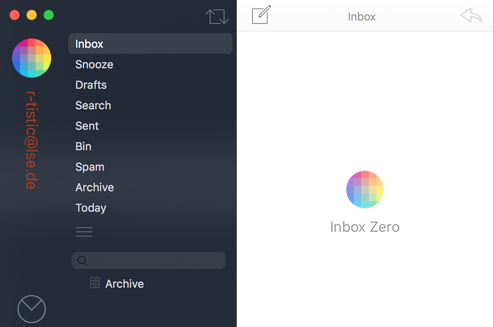

```{r setup, include=FALSE}

options(htmltools.dir.version = FALSE)
library(tidyverse)
library(knitr)
library(grDevices)
library(Cairo)

```

```{r download-remark-bib, include=FALSE}

# xaringan::summon_remark(version = "latest", to = "remark-lib/")

```

```{r make-pdf, message=FALSE, warning=FALSE, include=FALSE}

# system("~/decktape-1.0.0/phantomjs ~/decktape-1.0.0/decktape.js ~/R/R-tistic/aCourses/01-introduction-slides.html ~/R/R-tistic/aCourses/01-introduction-slides.pdf")

#system("~/decktape-1.0.0/phantomjs ~/decktape-1.0.0/decktape.js ~/slides/sanitation-systems-factsheets-slides.html ~/slides/sanitation-systems-factsheets-slides.pdf")

```

layout: true
class: theme

---
# Inbox: r-tistic@lse.de




--

.large[Did you have any issues with the preparation slides?]


---
## Typographical Conventions
***
.small[
*Italic*  
Indicates new terms URLs, email addresses, filenames and file extensions.

**Bold**  
Indicates the names of R Packages.

`Constant width`  
Used for program listings, as well as within paragraphs to refer to program elements such as variable or function names, databases, data types, environment variables, statements, and keywords.

**`Constant width bold`**  
Shows commands or other text that should be typed literally by the user.

*`Constant width italic`*  
Shows text that should be replaced with user-supplied values or by values determined by context.
]

.footnote[
[taken from: Wickham, Grolemund, R for Data Science](http://bit.ly/2n0YYah)
]

---
## Getting started
***
### Download and install R

* Go to http://www.r-project.org
* Download R for your operating system
* Install R
* Bring yourself and your laptop to Eawag (Room Aqualino) on 16.03.2017 at 01:30 pm


---
## Getting started
***
### Download and install RStudio

* Go to https://www.rstudio.com
* Download RStudio for your operating system (Linux, (Mac) OS X, Windows)
* Install RStudio

---

## Getting started
***
### Open RStudio 

- type `print("hello world")` into the Console and hit `↵`

--

Output:
```{r tidy=FALSE}
print("hello world")
```

--

Congrats! You have just written your first R code.

---
## Getting started
***
### Install packages 

- type `install.packages("tidyverse")` into the Console
    - this installs the R packages: `ggplot2`, `tibble`, `tidyr`, `readr`, `purrr` and `dplyr`
- type `library(tidyverse)` into the Console and hit `↵`

```{r, echo=TRUE}

library(tidyverse)

```

---
## Getting started
***
### Plot a graph
- type the code below into the console and hit `↵`

```{r intro, echo = TRUE, fig.height = 3, fig.width= 8, dev = 'svg'}

g1 <- ggplot(mpg, aes(x = displ, y = hwy)) +
  geom_point() +
  theme_bw(base_size = 16)

g1

```

---
## Troubleshooting
***
### Write me an email

If you had trouble with any of the previous tasks, please write an email to r-tistic@lse.de

Otherwise, see you at the class on Thursday!


.footnote[Source of .gif file: http://giphy.com/search/im-so-excited]

---
## R-tistic
***
### Overview

1. Introduction to R and RStudio
    - basics of data visualisation 
    - basics of reproducible research
2. Basics of data manipulation
3. Basics of using R for statistical analyses
4. Basics of Git, GitHub and collaborative programming
5. Advanced classes of the above


---
## Why use R?
***

- R is able to perform every type data analyses.
- R is free and open source.
- R is a language and is interactive.
- R produces amazing graphics.
- R has a fast growing user network.
- …and many more reasons.

---
## Why use R?
***
### Data Analyses
  
- why do we analyse data?
    - to summarise data in tables and graphs.
    - to explore relationships in data by using statistical analysis.
    - to visualise data for publications.
    - to get answers for our questions.
  
---
## Why use R?
***
### Data Analyses

.pull-left[  
- what types of data analyses do you know?
    - descriptive
    - exploratory
    - inferential
    - predictive
    - causal
    - mechanistic
- nothing that's not possible in R
]

.pull-right[
- read...


]

.footnote[
[Jeff Leek: The Elements of Data Analytic Style](http://bit.ly/2eojZpq)
]

---
## Why use R?
***
### Data Visualisation

.big[
Talk:  
[Stefanie Posavec on Data Visualization at Awwwards Conference London](http://bit.ly/2ndtMFf)
]

.big[
Great resource:  
[Data visualisation catalogue](http://bit.ly/2jVa6RT)
]

.big[
Another great resource:  
[R Graph Gallery](http://bit.ly/2nqR6je)
]

---
## Why use R?
***
### Data Visualisation

Maps with **leaflet** package.

```{r leaflet, echo=FALSE, fig.height= 5, fig.width= 11.5}

library(leaflet)

m <- leaflet() %>%
  addTiles() %>%  # Add default OpenStreetMap map tiles
  addMarkers(lng=174.768, lat=-36.852, popup="The birthplace of R")
m  # Print the map

```

.footnote[
[Click here to learn more!](http://bit.ly/2ntsVNJ)
]

---
## Why use R?
***
### Data Visualisation
Interactive plots with **plotly** package.

```{r plotly, echo=FALSE, fig.height=5.5, fig.width=11.5, message=FALSE, warning=FALSE}

library(plotly)
 
# Let's make it interactive using the ggplotly function !
g2 <- ggplotly(g1)

g2

```

.footnote[
[Learn more about plotly](http://bit.ly/2n2Acqm)
]

---
## Why use R?
***
### Data Visualisation

```{r, echo=FALSE, fig.height=5.5, fig.width=11}

library(ggplot2)
library(plotly)

p3 <- ggplot(data = diamonds, aes(x = cut, fill = clarity)) +
            geom_bar(position = "dodge") +
  theme_bw(base_size = 20)

ggplotly(p3)

```


.footnote[
[Learn more about htmlwidgets in R](http://bit.ly/2mS8MCO)
]

---
## Why use R?
***
### More than 10'000 other packages
.big[
Nice curated list of R packages here:   
[Awesome R](http://bit.ly/2ncQ2Pw)
]
---
## Why use R?
***
### Because R Markdown!

- fully reproducible documents in all formats
    - HTML
    - PDF
    - MS Word
    - HTML5 slides
    - Tufte-style handouts
    - books
    - dashboards
    - shiny applications
    - scientific articles
    - websites
    - ...

.footnote[
[Click here to learn more](http://bit.ly/2nbLxF3)
]

---
## R Markdown
***
### Install R Markdown

- type `install.packages("rmarkdown")` into the Console and hit `↵`

--

- go to `File -> New File -> R Markdown...`

--


---
## RMarkdown
***
### Tutorial

Follow the instructions on the screen.

---
## Why use R?
***
### Open...

.pull-left[
- open access
- open data
- open research
- open science
- open government
]

--

.pull-right[
- open university
- open learning
- open education
- open source
- open everywhere
]

---
## Open Data
***
### Everywhere

.footnote[
[Open Data Twitter List](http://bit.ly/2mOjbzo)
]

.pull-left[
- [European Data Portal](http://bit.ly/2msPXne)
- [Open Data Zurich](http://bit.ly/2mZXFYV)
- [World Bank DataBank](http://bit.ly/2nnLG8J)
- [World Bank Microdata Library](http://bit.ly/2nanRAx)
- [rOpenSci Community](http://bit.ly/2kh46qg)
- [Stats South Africa](http://bit.ly/2nsHpxw)
- [ArcGis opendata](http://arcg.is/2n03cip) 
- [Open Knowledge International](http://bit.ly/2msKCeQ)
- [Gapminder](http://bit.ly/2nnJC0y)
]

--

.pull-right[

]

--

.large[
.center[But, what to do with all of this?]
]

---
## Data
***
### Fuel Economy Data

- type **`?mpg`** into the Console

--

.center[
.large[ 
What is this dataset about?
]
]

```{r mpg, echo=FALSE}

head(mpg)

```


---
## Data
***
### Gapminder

- type **`?gapminder`** into the Console

--

- type **`??gapminder`** into the Console

--

- use **`Google`**

--

- type **`install.packages("gapminder")`** into the Console

--

- type **`?gapminder`** into the Console

.footnote[
[Gapminder Homepage. Please visit!](http://bit.ly/2nnJC0y)  
]

---
## Data
***
### Gapminder

- type **`library(gapminder)`** into the Console
- type **`str(gapminder)`** into the Console

--

```{r gapminder}

library(gapminder)

str(gapminder)


```


---
## Data
***
### Diamonds

- type **`?diamonds`** into the Console

--

- what is the dataset about?

--

- type **diamonds** into the Console

--

```{r}

diamonds

```


---
## R and RStudio
***
### First steps with Software Carpentry

Please go to the following website and follow through the instructions until you reach the challenges at the bottom of the page.

.superlarge[
.center[
[Software Carpentry](http://swcarpentry.github.io/r-novice-gapminder/01-rstudio-intro/)
]
]

---
## R and RStudio
***
### First steps with swirl package

.pull-left[
Learn R, in R. 

- open the [swirl website](http://bit.ly/2mKAY9c)
- click on learn
    - Step 1: Done that
    - Step 2: Done that too
    - Step 3: Install swirl
    - Step 4: Start swirl
    - Step 5: ...
]

.pull-right[

]


---
## RStudio
***
### Start your first script

- go to `File -> New File -> R Script...`


---
## RStudio
***
### Overview


---
## RStudio
***
### Themes


---
## RStudio
***
### Themes


---
## RStudio
***
### The # key and rm(list = ls())


---
## R Scripts
***
### Why using scripts?

- we could do everything in the console, so why bother using a script?
- record of what you did and why (includes comments after #)
- allows you to quickly repeat the analysis and make changes
- the code in the console will not be saved, but you can save the script

---
## R Scripts
***
### Workflow

- type code into the Script
- add notes after # to remember what you are doing
- run the code (select it and then Ctrl + R or cmd + enter)
- if it’s not working, edit the Script and run it again
- save the final Script including comments
- the script can be reused at any time 

---
## R Scripts
***
### Write your first script

- write the preparation code into a script

--

keep in mind:

--

- make comments
- load necessary libraries
--

- save your script file
- make sure you remember where and the name
- close RStudio (do not save the workspace)
- find and open your Script
- remember keyboard shortcuts:
- ctrl + A / cmd + A
- ctrl + R / cmd + enter


---
## Replication and Reproducibility
***
### Replication

- focuses on the validity of the scientific claim
- "Is this claim true?"
- the ultimate standard for strengthening scientific evidence
- new investigators, data, analytical methods, laboratories, instruments, etc.
- particularly important in studies that can impact broad policy or regulatory decisions

.footnote[
Slide taken from: [@jtleek and @rdpeng](http://bit.ly/2n03MfN)
Additional reading:
[Jon Zelner - Reproducibility starts at home](http://bit.ly/2m0KwQo) [A manifesto for reproducible science](http://go.nature.com/2jm3QSx) [@jtleek and @rdpeng: Reproducible research can still be wrong](http://bit.ly/2msDe37 )
]

---
## Replication and Reproducibility
***
### Reproducibility

- focuses on the validity of the data analysis
- "can we trust this analysis?"
- arguably a minimum standard for any scientific study
- new investigators, same data, same methods
- important when replication is impossible

.footnote[
Slide taken from: [@jtleek and @rdpeng](http://bit.ly/2n03MfN)
]

---
## Replication and Reproducibility
***
### Background and underlying trends

- some studies cannot be replicated: no time, no money, unique/opportunistic
- technology is increasing data collection throughput; data are more complex and high-dimensional
- existing databases can be merged to become bigger databases (but data are used off-label)
- computing power allows more sophisticated analyses, even on "small" data
- for every field "X" there is a "Computational X"

.footnote[
Slide taken from: [@jtleek and @rdpeng](http://bit.ly/2n03MfN)
]

---
## Replication and Reproducibility
***
### The result?


- even basic analyses are difficult to describe
- heavy computational requirements are thrust upon people without adequate training in statistics and computing
- errors are more easily introduced into long analysis pipelines
- knowledge transfer is inhibited
- results are difficult to replicate or reproduce
- complicated analyses cannot be trusted

.footnote[
Slide taken from: [@jtleek and @rdpeng](http://bit.ly/2n03MfN)
]


