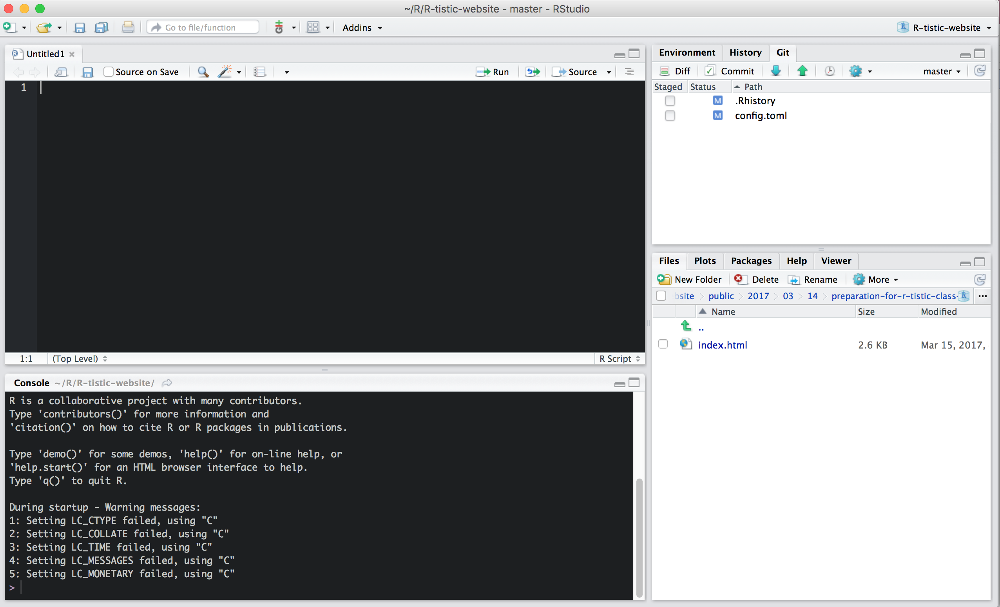

```{r setup, include=FALSE}

options(htmltools.dir.version = FALSE)

# Load libraries  -------------------------------------------------

library(tidyverse)
library(knitr)
library(grDevices)
library(Cairo)

# Set up plotly account  -------------------------------------------------

Sys.setenv(plotly_username = "larnsce")
Sys.setenv(plotly_api_key = "ShAAshkEbrcp21MxwZZc")

```

```{r download-remark-bib, include=FALSE}

# xaringan::summon_remark(version = "latest", to = "remark-lib/")

```

```{r make-pdf, message=FALSE, warning=FALSE, include=FALSE}

## print slides as PDF document

# system("~/decktape-1.0.0/phantomjs ~/decktape-1.0.0/decktape.js ~/R/R-tistic/aCourses/01-introduction-slides.html ~/R/R-tistic/aCourses/01-introduction-slides.pdf")

```

layout: true
class: theme

---
## R-tistic
***
### Overview

1. Introduction to R and RStudio
    - basics of data visualisation 
    - basics of reproducible research
2. Basics of data manipulation
3. Basics of using R for statistical analyses
4. Basics of Git, GitHub and collaborative programming
5. Advanced classes of the above


---
## Why use R?
***

- R is able to perform every type data analyses.
- R is free and open source.
- R is a language and is interactive.
- R produces amazing graphics.
- R has a fast growing user network.
- …and many more reasons.

---
## Why use R?
***
### Data Analyses
  
- why do we analyse data?
    - to summarise data in tables and graphs.
    - to explore relationships in data by using statistical analysis.
    - to visualise data for publications.
    - to get answers for our questions.
  
---
## Why use R?
***
### Data Analyses

.pull-left[  
- what types of data analyses do you know?
    - descriptive
    - exploratory
    - inferential
    - predictive
    - causal
    - mechanistic
- nothing that's not possible in R
]

.pull-right[
- read...


]

.footnote[
[Jeff Leek: The Elements of Data Analytic Style](http://bit.ly/2eojZpq)
]

---
## Why use R?
***
### Data Visualisation

.big[
Talk:  
[Stefanie Posavec on Data Visualization at Awwwards Conference London](http://bit.ly/2ndtMFf)
]

.big[
Great resource:  
[Data visualisation catalogue](http://bit.ly/2jVa6RT)
]

.big[
Another great resource:  
[R Graph Gallery](http://bit.ly/2nqR6je)
]

---
## Why use R?
***
### Maps with **leaflet** package.

```{r leaflet, echo=FALSE, fig.height= 5, fig.width= 11.5}

library(leaflet)

m <- leaflet() %>%
  addTiles() %>%  # Add default OpenStreetMap map tiles
  addMarkers(lng=174.768, lat=-36.852, popup="The birthplace of R")

m  # Print the map

```

.footnote[
[Click here to learn more!](http://bit.ly/2ntsVNJ)
]

---
## Why use R?
***
### Interactive plots with **plotly** package

<iframe width="800" height="500" frameborder="0" scrolling="no" src="//plot.ly/~larnsce/5.embed"></iframe>


```{r plotly, eval=FALSE, fig.height=5.5, fig.width=11.5, message=FALSE, warning=FALSE, include=FALSE}

library(plotly)
 
# Let's make it interactive using the ggplotly function !
g2 <- ggplotly(g1)

plotly_POST(g2, filename = "mpg-ggplot2")

```

.footnote[
[Learn more about plotly](http://bit.ly/2n2Acqm)
]

---
## Why use R?
***
### Interactive plots with **plotly** package

<iframe width="800" height="500" frameborder="0" scrolling="no" src="//plot.ly/~larnsce/3.embed"></iframe>

```{r, eval=FALSE, fig.height=5.5, fig.width=11, include=FALSE}

library(ggplot2)
library(plotly)

p3 <- ggplot(data = diamonds, aes(x = cut, fill = clarity)) +
            geom_bar(position = "dodge") +
  theme_bw(base_size = 20)

plot <- ggplotly(p3)

plotly_POST(plot, filename = "diamonds-plot")


```


.footnote[
[Learn more about htmlwidgets in R](http://bit.ly/2mS8MCO)
]


---
## Why use R?
***
### More than 10'000 other packages
.big[
Nice curated list of R packages here:   
[Awesome R](http://bit.ly/2ncQ2Pw)
]
---
## Why use R?
***
### Because R Markdown!

- fully reproducible documents in all formats
    - HTML
    - PDF
    - MS Word
    - HTML5 slides
    - Tufte-style handouts
    - books
    - dashboards
    - shiny applications
    - scientific articles
    - websites
    - ...

.footnote[
[Click here to learn more](http://bit.ly/2nbLxF3)
]

---
## R Markdown
***
### Install R Markdown

- type `install.packages("rmarkdown")` into the Console and hit `↵`

--

- go to `File -> New File -> R Markdown...`

--


---
## RMarkdown
***
### Live Tutorial

...

---
## Why use R?
***
### Open...

.pull-left[
- open access
- open data
- open research
- open science
- open government
]

--

.pull-right[
- open university
- open learning
- open education
- open source
- open everywhere
]

---
## Open Data
***
### Everywhere

.footnote[
[Open Data Twitter List](http://bit.ly/2mOjbzo)
]

.pull-left[
- [European Data Portal](http://bit.ly/2msPXne)
- [Open Data Zurich](http://bit.ly/2mZXFYV)
- [World Bank DataBank](http://bit.ly/2nnLG8J)
- [World Bank Microdata Library](http://bit.ly/2nanRAx)
- [rOpenSci Community](http://bit.ly/2kh46qg)
- [Stats South Africa](http://bit.ly/2nsHpxw)
- [ArcGis opendata](http://arcg.is/2n03cip) 
- [Open Knowledge International](http://bit.ly/2msKCeQ)
- [Gapminder](http://bit.ly/2nnJC0y)
]

--

.pull-right[

]

--

.large[
.center[But, what to do with all of this?]
]

---
## Data
***
### Fuel Economy Data

- type **`?mpg`** into the Console

--

.center[
.large[ 
What is this dataset about?
]
]

```{r mpg, echo=FALSE}

head(mpg)

```


---
## Data
***
### Gapminder

- type **`?gapminder`** into the Console

--

- type **`??gapminder`** into the Console

--

- use **`Google`**

--

- type **`install.packages("gapminder")`** into the Console

--

- type **`?gapminder`** into the Console

.footnote[
[Gapminder Homepage. Please visit!](http://bit.ly/2nnJC0y)  
]

---
## Data
***
### Gapminder

- type **`library(gapminder)`** into the Console
- type **`str(gapminder)`** into the Console

--

```{r gapminder}

library(gapminder)

str(gapminder)


```


---
## Data
***
### Diamonds

- type **`?diamonds`** into the Console

--

- what is the dataset about?

--

- type **diamonds** into the Console

--

```{r}

diamonds

```


---
## R and RStudio
***
### First steps with Software Carpentry

Please go to the following website and follow through the instructions until you reach the challenges at the bottom of the page.

.superlarge[
.center[
[Software Carpentry](http://swcarpentry.github.io/r-novice-gapminder/01-rstudio-intro/)
]
]

---
## R and RStudio
***
### First steps with swirl package

.pull-left[
Learn R, in R. 

- open the [swirl website](http://bit.ly/2mKAY9c)
- click on learn
    - Step 1: Done that
    - Step 2: Done that too
    - Step 3: Install swirl
    - Step 4: Start swirl
    - Step 5: ...
]

.pull-right[

]

---
## R and RStudio
***
### First steps with R Codeschool

.large[
Great way to learn R:  
[http://tryr.codeschool.com](http://bit.ly/2nrWfHQ)
]

---
## RStudio
***
### Start your first script

- go to `File -> New File -> R Script...`



---
## RStudio
***
### Overview


---
## RStudio
***
### Themes


---
## RStudio
***
### Themes


---
## RStudio
***
### The # key and rm(list = ls())


---
## R Scripts
***
### Why using scripts?

- we could do everything in the console, so why bother using a script?
- record of what you did and why (includes comments after #)
- allows you to quickly repeat the analysis and make changes
- the code in the console will not be saved, but you can save the script

---
## R Scripts
***
### Workflow

- type code into the Script
- add notes after # to remember what you are doing
- run the code (select it and then Ctrl + R or cmd + enter)
- if it’s not working, edit the Script and run it again
- save the final Script including comments
- the script can be reused at any time 

---
## R Scripts
***
### Write your first script

- write the preparation code into a script

--

keep in mind:

--

- make comments
- load necessary libraries
--

- save your script file
- make sure you remember where and the name
- close RStudio (do not save the workspace)
- find and open your Script
- remember keyboard shortcuts:
- ctrl + A / cmd + A
- ctrl + R / cmd + enter


