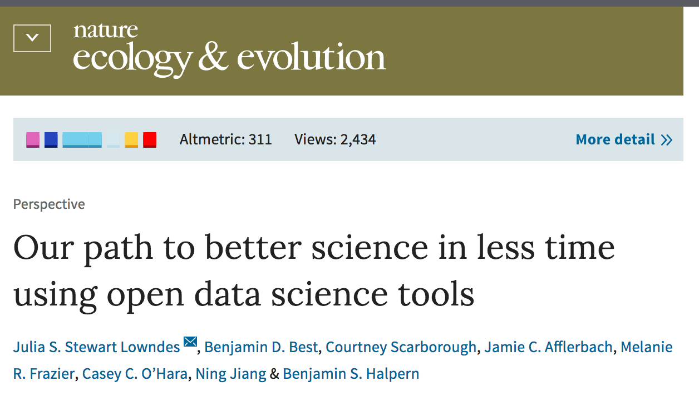
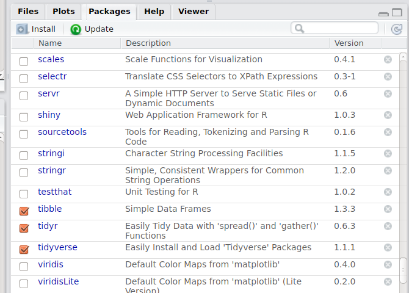

```{r setup, include=FALSE}

options(htmltools.dir.version = FALSE)

rm(list = ls())

library(tidyverse)
library(knitr)
library(grDevices) 
library(Cairo)
library(gapminder)
library(gridExtra)
library(nycflights13)
library(DT)


```

```{r download-remark-bib, include=FALSE}

# xaringan::summon_remark(version = "latest", to = "remark-lib/")

```

```{r make-pdf, message=FALSE, warning=FALSE, include=FALSE}

## print slides as PDF document

# system("~/decktape-1.0.0/phantomjs ~/decktape-1.0.0/decktape.js ~/R/R-tistic/aCourses/02-data-visualisation.html ~/R/R-tistic/aCourses/02-data-visualisation.pdf")


```

layout: true
class: theme

---
## R-tistic
***
### Overview

1. Introduction to R and RStudio
    - basics of data visualisation 
    - basics of reproducible research  
2. **Basics of data manipulation**
3. Basics of using R for statistical analyses
4. Basics of Git, GitHub and collaborative programming
5. Advanced classes of the above

---
## Last course
***
### Basics of data visualisation

```{r, echo=FALSE, fig.height=6, fig.width=12, message=FALSE, warning=FALSE}

g_freq <- ggplot(mpg, aes(displ, colour = drv)) +
  geom_freqpoly(binwidth = 0.5) +
  theme_bw(base_size = 20)

g_hist <- ggplot(mpg, aes(displ, fill = drv)) +
  geom_histogram(binwidth = 0.5)  +
  facet_wrap(~drv, ncol = 1) +
  theme_bw(base_size = 20)

grid.arrange(g_freq, g_hist, ncol = 2)

```

--

What have you worked on between then (16.03.2017) and today?

---
## Practice,...
***
### ...practice, practice. 

> But while you should expect to be a little frustrated, take comfort in that it’s both typical and temporary: it happens to everyone, and the only way to get over it is to keep trying. - Hadley Wickham (R for Data science)


Use Hadley's book. It's available freely online. [(link)](http://bit.ly/2n0YYah)

Use online resources. They are freely available online.   
[(link to R Codeschool)](http://bit.ly/2nrWfHQ)
[(link to Software Carepentry)](http://bit.ly/2r9Z6Eu)

Read blogs. The R community is growing steadily.
[(link to R-Bloggers)](http://bit.ly/2qrHrqI)

Get help!
[(link to Stack Overflow)](http://bit.ly/2rLnvmm)

Ask questions on our very own Slack channel.
[(link to Slack)](http://bit.ly/rtisticslack)


---
## Motivation
*** 
### Read some articles by other researchers

> “You need to learn how to talk to R so you can do some basic things before you get to the cool modelling.” - [Auriel Fournier](http://bit.ly/2r9RgdJ)

> For example, scientists need to be comfortable opening and creating data files or creating subsets of data before starting to run analyses. - [Monya Baker (Scientific computing: Code alert)](http://go.nature.com/2qtEXXL)


---
## Motivation
***
### Definitely read this one!



[link](http://go.nature.com/2rciLWm)

---
## Learn tricks
***
### Keyboard shortcuts for today

.big[cmd (ctrl) + shift + M]  

.big[alt + -] 

.big[ctrl + 1] 

.big[ctrl + 2] 

Now press Alt-Shift-K

---
class: inverse, middle, center

.superlarge[Coding basics]


---
## Coding basics
***
### Use R as a calculator

You can use R as a calculator. Type some commands into the console.

```{r}
10 * 35 / 20 
```

--

```{r}
(10 + 50 + 4.5) * 80 / 10
```

--

```{r}
sin(pi / 2)
```


---
## Coding basics
***
### Create objects with <-

```{r}

x <- sqrt(64)

```

`object_name <- value`

This is an assingment statement. You can read it as "object name gets value".

--

**Remember the shortcut: alt + -** 


---
## Coding basics
***
### Object names

- must start with a letter, 
- can only contain letters, numbers, _ and ., 
- should be descriptive,
- and therefore require a convention for multiple words

    i_use_snake_case  
    otherPeopleUseCamelCase  
    some.people-use.periods  
    And_aFew.People_RENOUNCEconventions  
    
More on code style: ...

---
## Auto-complete
***
### Inspect an object

Make another object

```{r}

this_is_a_very_long_name <- 2.5

```

Now, type "this" into the Console and then press Tab.

---
## Be precise
***
### Make another object

```{r}

r_is_cool <- 10 ^ 5

```

Inspect it:

`R_is_cool` 

`r_is_coll`

--

Case matters. Typos matter.

---
## Calling Functions
***
### 

R has a large collection of built-in functions that are called like this:

`function_name(arg1 = val1, arg2 = val2)`


---
## Calling Functions
***
### seq()

- Type `se` into the Console and hit Tab.

--

```{r}

seq(1, 10)

```


---
## Making assingments
***
### 

If you make an assignment, then you don't see the value. 

```{r}

y <- seq(1, 10, length.out = 5)

```

--

Double-check the result by typing the object name and hit enter.

```{r}

y

```

---
## Environment
***
### Check it out


---
class: inverse, middle, center

.superlarge[Software versions]

---
## Software versions
***
### Check your versions

What's your version of:

- `R`
- `RStudio`
- `tidyverse`
- `dplyr`

---
## Software versions
***
### Check your versions


```{r}

R.version   # type this into the console

```

---
## Software versions
***
### Check your versions


```{r}

RStudio.Version()

```

---
## Software versions
***
### Check your versions

```{r}

installed.packages()

```


---
## Software versions
***
### Check your versions



---
## Software versions
***
### Check your versions

```{r, eval = FALSE, message = FALSE, warning = FALSE}

# list all packages where an update is available
old.packages()

# update all available packages
update.packages()

# update, without prompts for permission/clarification
update.packages(ask = FALSE)

```

---
class: inverse, middle, center

.superlarge[Data Transformation with `dplyr`]


---
## Data Transformation
***
### Prerequisites

- start a new R script or an R Markdown file (for those who are familiar)
- install the `nycflights13` package using the Console (`Crtl + 2`)
- load the `nycflights13` package into your R script
- install the `tidyverse` package using the Console
- load the `tidyverse` package into your R script


---
## nycflights13
***
### Explore a bit!

The data comes from the [US Bureau of Transportation Statistics](http://www.transtats.bts.gov/DatabaseInfo.asp?DB_ID=120&Link=0).

- use `?flights` to access the help file of the dataset
- type `flights` into the console
- use `ggplot2` to make some graphs

---
## nycflights13
***
### What have you explored?

.pull-left[

]

--

.pull-right[

]

.footnote[
Images taken from [https://giphy.com/](https://giphy.com/)
]


---
## nycflights13
***
### Dataset

What do you notice? What is unfimilar?

```{r, echo=FALSE, message=FALSE, warning=FALSE}

flights

```


---
## nycflights13
***
### Types of Variables 

- `int` stands for integers
- `dbl` stands for doubles, or real numbers
- `chr` stands for character vectors, or strings
- `dttm` stands for date-times (a date + a time)

--

Three other common variables not used in this dataset:

- `lgl` stands for logical, vectors that contain only `TRUE` or `FALSE`
- `fctr` stands for factors, which R uses to represent categorical variables with fixed possible values
- `date` stands for dates


---
## nycflights13
***
### Save the dataframe to your environment

--

For example:

```{r}

nycflights_df <- flights

```


---
class: inverse, middle, center

.superlarge[Filter rows with filter()]

---
## dplyr Basics
***
### five key dplyr functions

--

- pick observations by their values with `filter()`
- reorder the rows with `arrange()`
- pick variables (columns) by their names with `select()`
- create new variables with functions of existing variables with `mutate()`
- collapes many values down to a single summary with `summary()`

--

These can be used in conjunction with `group_by`, which changes the scope of each function from operating on the entire dataset to operating on it group-by-group.


---
## dplyr Basics
***
### filter rows with filter()

- subset observations based on their value

```{r, eval=FALSE, message=FALSE, warning=FALSE}

filter(.data = nycflights_df, month == 1, day == 1)

```


```{r}

nycflights_df %>% 
  filter(month == 1, day == 1)

```

---
## nycflights13
***
### Save the new dataframe

For example:

```{r}

nycflights_df_0101 <- nycflights_df %>% 
  filter(month == 1, day == 1)

```


---
## nycflights13
***
### Exercise

.task[Filter the dataframe by JetBlue Airways and save the resulting dataframe as a new object.]

--

Subtasks:

- identify variable that identifies the airline
- look up which carrier code represents JetBluw Airways
- use `filter()` to subset the dataframe
- save resulting dataframe as a new object

---
## nycflights13
***
### Exercise

```{r, eval=FALSE, message=FALSE, warning=FALSE}

?flights
?airlines


```

```{r}

airlines

```


---
## nycflights13
***
### Exercise

Note: Character variables have to be in parenthesis.

```{r, eval=FALSE}

nycflights_df %>% 
  filter(carrier == "B6")

```

```{r, eval=FALSE}

nycflights_df_B6 <- nycflights_df %>% 
  filter(carrier == "B6")

```

---
## nycflights13
***
### Exercise

.task[
- Identify all flights departing from John F Kennedy Intl. Airport with the destination of Austin Bergstrom on April 1st 2013.]

--

.task[
- What was the total departure delay for those flights on that day?
]

---
## nycflights13
***
### Result

This is just one way of doing it.

```{r}

nycflights_df %>% 
  filter(
    origin == "JFK",
    dest == "AUS",
    day == 1,
    month == 4
  ) 

```


---
## Comparison operators
***
### R provides standard operators

- `>` bigger 
- `>=` bigger and equal
- `<` smaller 
- `<=` smaller and equal
- `!=` not equal
- `==` equal

---
## Comparison operators
***
### Common mistake

.task[Type `filter(flights, month = 1)` into the console]

---
## Comparison operators
***
### Another common problem: floating point numbers

What is the squareroot of 2?
What is 1 divided by 49?

--

```{r}

sqrt(2)

```

```{r}

1/49

```

---
## Comparison operators
***
### Another common problem: floating point numbers

What is the squareroot of 2 by the power of 2?
What is 1 divided by 49 times 49?

```{r}

sqrt(2) ^ 2

```

```{r}

1/49 * 49

```


---
## Comparison operators
***
### Another common problem: floating point numbers

Now ask are R whether this result is actually true.

```{r}

sqrt(2) ^ 2 == 2

```

```{r}
1/49 * 49 == 1
```

---
## Comparison operators
***
### Keep in mind

- computers use finite precision arithmetic
- computers **cannot** store an infinite number of digits
- every number you see is an approximation

---
## Logical operators
***
### Multiple arguments in filter()

.big[Remember?]

Identify all flights departing from John F Kennedy Intl. Airport with the destination of Austin Bergstrom on April 1st 2013.

---
## Logical operators
***
### Multiple arguments in filter()

.big[Remember?]

Identify all flights departing from John F Kennedy Intl. Airport **and** with the destination of Austin Bergstrom **and** on April 1st 2013.

--

Every expression must be true in order for a row to be included in the output. Boolean operators need to be used by yourself for other types of combinations.

```{r, eval = FALSE}

nycflights_df %>% 
  filter(
    origin == "JFK",
    dest == "AUS",
    day == 1,
    month == 4
  ) 

```

---
## Logical operators
***
### Boolean operators

`x` is the left-hand circle, `y` is the right-hand circle, and the shaded region show which parts each operator selects.


.footnote[Image taken from: [Wickham, R for Data Science](http://bit.ly/2sddvjD)]


---
## Logical operators
***
### Boolean operators

The following code finds all flights that departed in November or December:


```{r, eval=FALSE}

filter(flights, month == 11 | month == 12)

```

---
## Logical operators
***
### Boolean operators: Be aware!

You cannot write the following to get to the same result.

```{r, eval=FALSE}

filter(flights, month == 11 | 12)

```

If you are interested why: read more [here](http://bit.ly/2sddvjD).

---
## Missing values
***

- in R missing values are shown as `NA` ("not availables")
- `NA` represents an unknown value
    - it is **not** `0`
- almost any operation involving an unknown value will also be unknown

--

```{r}

NA > 5
10 == NA

```

---
## Missing values
***
### Example

Let x be Mary's age. We don't know how old she is.

```{r, eval=FALSE}

x <- NA

```

--

Let y be John's age. We don't know how old he is.

```{r}

y <- NA

```

--

Are John and Mary the same age?

```{r}

x == y

# We don't know!

```

---
## Missing values
***
### is.na()

If you want to determine if a value is missing, use is.na():

```{r}

df <- tibble(x = c(1, NA, 3))

is.na(df)

```

---
## Missing values
***
### is.na()

- filter() only includes rows where the condition is `TRUE`
- filter excludes both `FALSE` and `NA` values

```{r}

filter(df, x > 1)

```

---
## Missing values
***
### is.na()

If you want to preserve missing values when using `filter()`, ask for them explicitly:

```{r}
filter(df, is.na(x) | x > 1)
```


---
## Final exercise
***
### Tasks

1. Find all flights that
    1. Had an arrival delay of two or more hours
    2. Flew to Houston (IAH or HOU)
    3. Were operated by United, American, or Delta
    4. Arrived more than two hours late, but didn’t leave late
    5. Departed between midnight and 6am (inclusive)
    
---
## Final exercise
***
### Solutions

Find all flights that had an arrival delay of two or more hours

```{r}

flights %>% 
  filter(arr_delay > 120)

```


---
## Final exercise
***
### Solutions

Find all flights that flew to Houston (IAH or HOU)


```{r}


flights %>%
  filter(dest == "IAH" | dest == "HOU")


```


---
## Final exercise
***
### Solutions

Find all flights that were operated by United, American, or Delta.

The variable carrier has the airline: but it is in two-digit carrier codes. However, we can look it up in the `airlines` dataset.

--

```{r}

airlines

```


---
## Final exercise
***
### Solutions

Find all flights that were operated by United, American, or Delta.

```{r}

flights %>%
  filter(
    carrier == "AA" | 
    carrier == "DL" | 
    carrier == "UA" 
    )

```


---
## Final exercise
***
### Solutions

Find all flights that arrived more than two hours late, but didn’t leave late.

--

```{r}

flights %>% 
  filter(dep_delay <= 0, arr_delay > 120)

```


---
## Final exercise
***
### Solutions

Find all flights that departed between midnight and 6am (inclusive)

```{r}

flights %>% 
  filter(
  dep_time <= 600 | dep_time == 2400 
  )


```


---
class: inverse, middle, center

.superlarge[Arrange rows with dplyr arrange()]

---
## arrange()
***

- changes the order of rows in a dataframe instead of selecting them 
- takes a dataframe and a column name to order by

```{r}

flights %>% 
  arrange(dep_time)

```

---
## arrange()
***

- changes the order of rows in a dataframe instead of selecting them 
- takes a dataframe and a column name to order by
- can also take two or more columns to order by

```{r}

flights %>% 
  arrange(dep_time, day)

```


---
class: inverse, middle, center

.superlarge[Select columns with dplyr select()]


---
## select()
***

- it's not uncommon to get datasets with hundreds or thousands of variables (columns)
- first challenge can be to narrow down the variables you are interested in
- `select()` allows you to rapidly zoom in on a useful subset using operations based on the names of the variables

---
## select()
***
### examples

Select columns by name:

--

```{r}

flights %>% 
  select(year, month, day)

```


---
## select()
***
### examples

Select all columns between year and day (inclusive):

--

```{r}

flights %>% 
  select(year:day)

```


---
## select()
***
### examples

Select all columns except those from year and day (inclusive):

--

```{r}

flights %>% 
  select(-(year:day))

```


---
## select()
***
### helper functions

.task[A number of helper functions can be used with `select()`. Have a look at the helpfile to explore those.]


---
## select()
***
### helper functions

- `starts_with("abc")`: matches names that begin with “abc”.
- `ends_with("xyz")`: matches names that end with “xyz”.
- `contains("ijk")`: matches names that contain “ijk”.
- `num_range("x", 1:3)` matches x1, x2 and x3.

---
## select()
***
### exercise

.task[Brainstorm as many ways as possible to select `dep_time`, `dep_delay`, `arr_time`, and `arr_delay` from `flights` dataset.]

---
## select()
***
### solutions

```{r}

flights %>% 
  select(dep_time, dep_delay, arr_time, arr_delay)

```

---
## select()
***
### solutions

```{r}

flights %>% 
  select(starts_with("dep_"), starts_with("arr_"))

```

---
## select()
***
### exercise

.task[What happens if you include the name of a variable multiple times in a `select()` call?]

---
## select()
***
### solution

```{r}

flights %>% 
  select(year, month, day, year, year)

```

---
## select()
***
### task

.task[What does the `one_of()` function do? Why might it be helpful in conjunction with this vector?]

    vars <- c("year", "month", "day", "dep_delay", "arr_delay")
    
---
## select()
***
### solution

```{r}

vars <- c("year", "month", "day", "dep_delay", "arr_delay")

flights %>%
  select(
    one_of(vars)
  )

```


---
class: inverse, middle, center

.superlarge[Rename variables (columns) with dplyr rename()]


