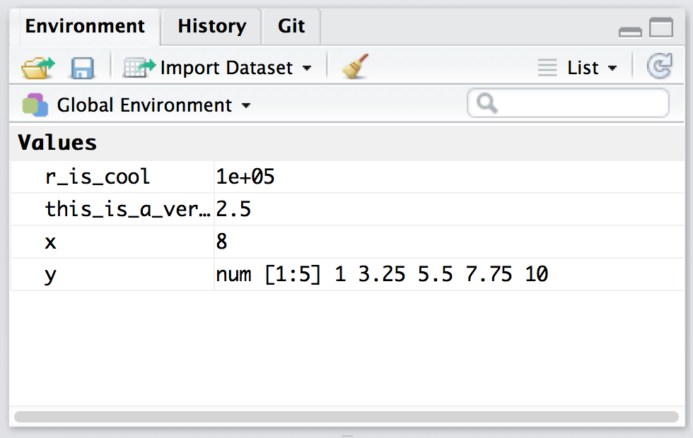

```{r setup, include=FALSE}

options(htmltools.dir.version = FALSE)

rm(list = ls())

library(tidyverse)
library(knitr)
library(grDevices)
library(Cairo)
library(gapminder)
library(gridExtra)
library(nycflights13)


```

```{r download-remark-bib, include=FALSE}

# xaringan::summon_remark(version = "latest", to = "remark-lib/")

```

```{r make-pdf, message=FALSE, warning=FALSE, include=FALSE}

## print slides as PDF document

# system("~/decktape-1.0.0/phantomjs ~/decktape-1.0.0/decktape.js ~/R/R-tistic/aCourses/02-data-visualisation.html ~/R/R-tistic/aCourses/02-data-visualisation.pdf")


```

layout: true
class: theme

---
## R-tistic
***
### Overview

1. Introduction to R and RStudio
    - basics of data visualisation 
    - basics of reproducible research  
2. **Basics of data manipulation**
3. Basics of using R for statistical analyses
4. Basics of Git, GitHub and collaborative programming
5. Advanced classes of the above

---
## Last course
***
### Basics of data visualisation

```{r, echo=FALSE, fig.height=6, fig.width=12, message=FALSE, warning=FALSE}

g_freq <- ggplot(mpg, aes(displ, colour = drv)) +
  geom_freqpoly(binwidth = 0.5) +
  theme_bw(base_size = 20)

g_hist <- ggplot(mpg, aes(displ, fill = drv)) +
  geom_histogram(binwidth = 0.5)  +
  facet_wrap(~drv, ncol = 1) +
  theme_bw(base_size = 20)

grid.arrange(g_freq, g_hist, ncol = 2)

```

--

What have you worked on between then (16.03.2017) and today?

---
## Practice,...
***
### ...practice, practice. 

> But while you should expect to be a little frustrated, take comfort in that it’s both typical and temporary: it happens to everyone, and the only way to get over it is to keep trying. - Hadley Wickham (R for Data science)


Use Hadley's book. It's available freely online. [(link)](http://bit.ly/2n0YYah)

Use online resources. They are freely available online.   
[(link to R Codeschool)](http://bit.ly/2nrWfHQ)
[(link to Software Carepentry)](http://bit.ly/2r9Z6Eu)

Read blogs. The R community is growing steadily.
[(link to R-Bloggers)](http://bit.ly/2qrHrqI)

Get help!
[(link to Stack Overflow)](http://bit.ly/2rLnvmm)

Ask questions on our very own Slack channel.
[(link to Slack)](http://bit.ly/rtisticslack)


---
## Motivation
*** 
### Read some articles by other researchers

> “You need to learn how to talk to R so you can do some basic things before you get to the cool modelling.” - [Auriel Fournier](http://bit.ly/2r9RgdJ)

> For example, scientists need to be comfortable opening and creating data files or creating subsets of data before starting to run analyses. - [Monya Baker (Scientific computing: Code alert)](http://go.nature.com/2qtEXXL)


---
## Motivation
***
### Definitely read this one!


[link](http://go.nature.com/2rciLWm)

---
## Learn tricks
***
### Keyboard shortcuts for today

.big[cmd (ctrl) + shift + M]  

.big[alt + -] 

.big[ctrl + 1] 

.big[ctrl + 2] 

Now press Alt-Shift-K

---
## Coding basics
***
### Use R as a calculator

You can use R as a calculator. Type some commands into the console.

```{r}

10 * 35 / 20 

(10 + 50 + 4.5) * 80 / 10

sin(pi / 2)


```

---
## Coding basics
***
### Create objects with <-

```{r}

x <- sqrt(64)

```

`object_name <- value`

This is an assingment statement. You can read it as "object name gets value".

--

**Remember the shortcut: alt + -** 


---
## Coding basics
***
### Object names

- must start with a letter, 
- can only contain letters, numbers, _ and ., 
- should be descriptive,
- and therefore require a convention for multiple words

    i_use_snake_case  
    otherPeopleUseCamelCase  
    some.people-use.periods  
    And_aFew.People_RENOUNCEconventions  
    
More on code style: ...

---
## Auto-complete
***
### Inspect an object

Make another object

```{r}

this_is_a_very_long_name <- 2.5

```

Now, type "this" into the Console and then press Tab.

---
## Be precise
***
### Make another object

```{r}

r_is_cool <- 10 ^ 5

```

Inspect it:

`R_is_cool` 

`r_is_coll`

Case matters. Typos matter.

---
## Calling Functions
***
### 

R has a large collection of built-in functions that are called like this:

`function_name(arg1 = val1, arg2 = val2)`


---
## Calling Functions
***
### seq()

- Type `se` and hit Tab.

--

```{r}

seq(1, 10)

```


---
## Making assingments
***
### 

If make an assignment, then you don't see the value. 

```{r}

y <- seq(1, 10, length.out = 5)

```

--

Double-check the result by typing the object name and hit enter.

```{r}

y

```

---
## Environment
***
### Check it out


---
## Data Transformation
***
### Prerequisites

- start an R script or an R Markdown file (for thos who are familiar)
- install and load the `nycflights13` package
- install and load the `tidyverse`

---
## nycflights13
***
### Explore a bit!

Data from: The data comes from the [US Bureau of Transportation Statistics](http://www.transtats.bts.gov/DatabaseInfo.asp?DB_ID=120&Link=0).

- use `?flights` to access the help file of the dataset
- type `flights` into the console
- use `ggplot2` to make some graphs

---
## nycflights13
***
### What have you explored?


http://gph.is/1eLpJRZ

---
## nycflights13
***
### hi


```{r}

# remove unneeded colums

mtcars %>% 
    select(-disp) %>% 
    head()

# re-order columns

mtcars %>% 
    select(cyl, disp, hp, everything()) %>% 
    head()

# rename columns

mtcars <- rename(mtcars, spam_mpg = mpg)
mtcars <- rename(mtcars, spam_disp = disp)
mtcars <- rename(mtcars, spam_hp = hp)

# Selecting columns with a regexp

mtcars %>% 
    select(contains("spam")) %>% 
    head()

# take also a look at starts_with(), ends_with(), contains(), matches(), #num_range(), one_of() and everything().

# Create new columns with mutate() and if_else()

mtcars %>% 
    mutate(vs_new = if_else(
        vs == 1, 
        "one", 
        "zero", 
        NA_character_)) %>% 
    head()

# case_when


mtcars %>% 
    mutate(carb_new = case_when(.$carb == 1 ~ "one",
                                .$carb == 2 ~ "two",
                                .$carb == 4 ~ "four",
                                 TRUE ~ "other")) %>% 
    head(15)

```


[lesser known dplyr tricks](http://bit.ly/2qsht6i)

[learn about the case_when function](https://rud.is/b/2017/03/10/making-a-case-for-case_when/)

.footnote[]


---
## Data processing
***
###

[Data processing workflow by ZevRoss](http://zevross.com/blog/2015/01/13/a-new-data-processing-workflow-for-r-dplyr-magrittr-tidyr-ggplot2/?utm_content=bufferd51d0&utm_medium=social&utm_source=twitter.com&utm_campaign=buffer)

---
## 
***
### 


---
## 
***
### 


---
## 
***
### 


---
## 
***
### 


---
## 
***
### 


---
## 
***
### 


---
## 
***
### 


---
## 
***
### 


---
## 
***
### 


