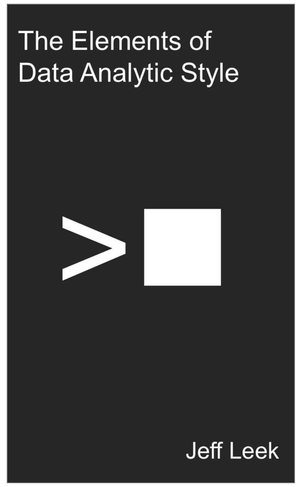

```{r setup, include=FALSE}
knitr::opts_chunk$set(echo = TRUE)
```


# Heading 1

## My heading 2

Let's write some text. This is the first praragprah of the second heading.

### an unordered list

- list item number 1
- list item number 2
- list item number 3
    - list item 3.1
    - list item 3.2
        - list item 3.2.1

#### an ordered list

1. I am number 1
2. I am numver 2
2. I am numver 3
3. I am numver 4

###

[Click here to see the awesome Sandec wesbite](www.sandec.ch)




```{r chunk-1, echo=FALSE, message=FALSE, warning=FALSE}

library(ggplot2)

g1<- ggplot(mpg, aes(x = displ, y = hwy)) +  
  geom_point()

# here is a comment

g1

```

