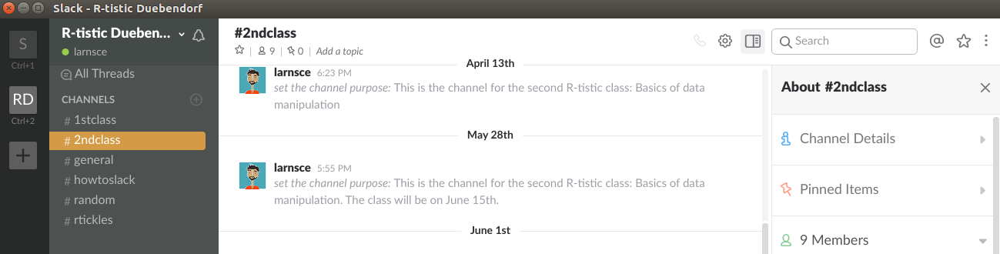
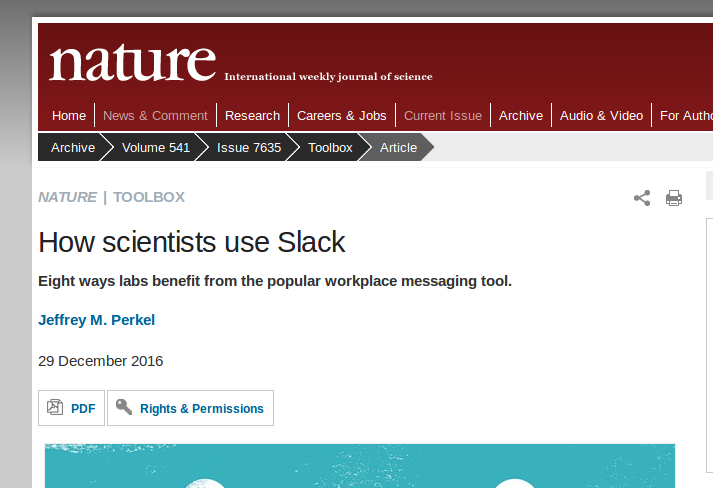
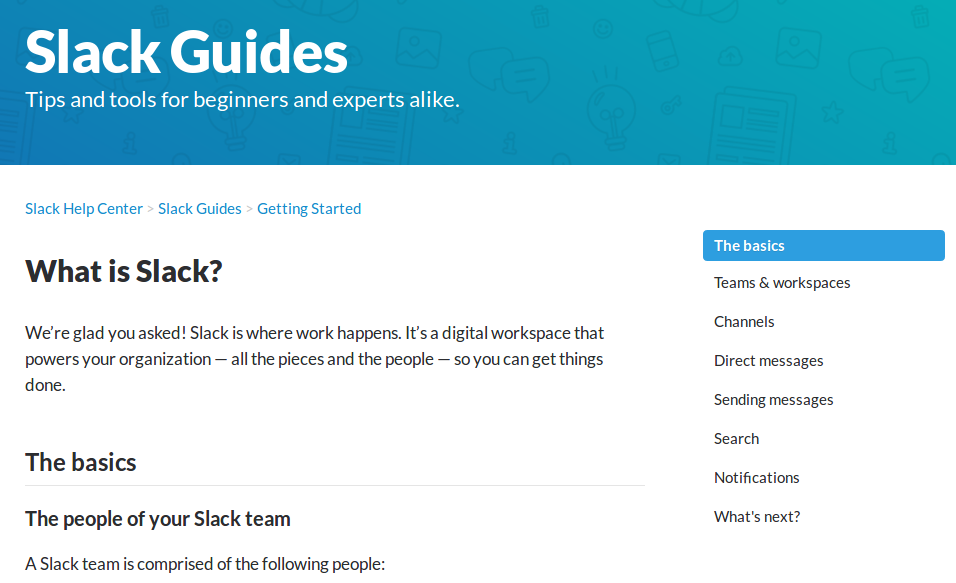

layout: true
class: theme

---
## R-tistic
***
### Overview

1. Introduction to R and RStudio
    - basics of data visualisation 
    - basics of reproducible research
2. Basics of data manipulation
    - using Slack for class communication
    - data manipulation with dplyr
3. Basics of using R for statistical analyses
4. Basics of Git, GitHub and collaborative programming
5. Advanced classes of the above

---
## R-tistic
***
### Overview

1. Introduction to R and RStudio
    - basics of data visualisation 
    - basics of reproducible research
2. Basics of data manipulation
    - **using Slack for class communication**
    - data manipulation with dplyr
3. Basics of using R for statistical analyses
4. Basics of Git, GitHub and collaborative programming
5. Advanced classes of the above

---
## Slack
***
### What is it?

Slack defines itself as: 

- team communication for the 21st century
- the place where work happens
- a digital workspace that powers your organisation

.footnote[
Inspired by [Slides](http://bit.ly/2rhmMWy) from [Nomaan Ahgharian](http://bit.ly/2t20iKt) under [CC BY 3.0 US](https://creativecommons.org/licenses/by/3.0/us/)
]

---
## Slack
***
### Why that name?

"Slack" in Urban Dictionary:

> An approach where one stops trying to make things happen or exert control, and instead simply "allows" or "lets" favorable events occur.

When you use Slack, you wait for things to happen to you most of the time!

.footnote[
Inspired by [Slides](http://bit.ly/2rhmMWy) from [Nomaan Ahgharian](http://bit.ly/2t20iKt) under [CC BY 3.0 US](https://creativecommons.org/licenses/by/3.0/us/)
]

---
## Slack
***
### How is that efficient?

> You: Isn't adding Slack to my tool set extra overhead?
>> Me: Maybe! 

--

> You: I am not convinced, it's going to be more overhead for me. Give me some good reasons to use it. 
>> Me: Get ready, I am about to blow your mind! 

--

> You: 

.footnote[
Inspired by [Slides](http://bit.ly/2rhmMWy) from [Nomaan Ahgharian](http://bit.ly/2t20iKt) under [CC BY 3.0 US](https://creativecommons.org/licenses/by/3.0/us/)
]

---
## Slack
***
### because

It means being efficient

--

`efficient = lazy`  
`lazy = slack`

therefore:

`slack = efficient`

.footnote[
Inspired by [Slides](http://bit.ly/2rhmMWy) from [Nomaan Ahgharian](http://bit.ly/2t20iKt) under [CC BY 3.0 US](https://creativecommons.org/licenses/by/3.0/us/)
]

---
## Slack
***
### because

It means easy communication with your whole team

- quickly switch from project to project, team to team
- accessible via any device, without VPN

It means accessing information quickly

- everything is easily searchable
- everything is persistent

.footnote[
Inspired by [Slides](http://bit.ly/2rhmMWy) from [Nomaan Ahgharian](http://bit.ly/2t20iKt) under [CC BY 3.0 US](https://creativecommons.org/licenses/by/3.0/us/)
]

---
## Email life
***
### does this look familiar?

.footnote[
Inspired by [Slides](http://bit.ly/2rhmMWy) from [Nomaan Ahgharian](http://bit.ly/2t20iKt) under [CC BY 3.0 US](https://creativecommons.org/licenses/by/3.0/us/). Source of image [here](https://s3.amazonaws.com/media-p.slid.es/uploads/209433/images/1523632/Screenshot_2015-06-22_15.07.06.png)
]

---
## Email life
***
### or this?

.footnote[
Inspired by [Slides](http://bit.ly/2rhmMWy) from [Nomaan Ahgharian](http://bit.ly/2t20iKt) under [CC BY 3.0 US](https://creativecommons.org/licenses/by/3.0/us/). Source of image/ [here](https://s3.amazonaws.com/media-p.slid.es/uploads/209433/images/1518737/responding_to_latest_message_copy_2.png)
]

---
## Email life
***
### many more examples

Poor file management.

> I cannot find the email with that one important attachement, can you please resend it?

--

Reply All. All the time!

> Thanks, **[insert your name]**! Very useful.

---
## Slack
***
### maybe an answer

---
## Slack
***
### Interesting read

.footnote[
Nature News: [How scientists use Slack](http://go.nature.com/2t24iuo) 
]

---
## Slack
***
### Let's use it for the class

--

You are all like:

---
## Slack
***
### The basics

Take some time and read this: [http://bit.ly/slack_basics](http://bit.ly/slack_basics)

---
## Final words
***

### Contact
.button1[[email](mailto:r-tistic@lse.de)]
.button1[[website](http://www.lse.de/r-tistic)]
.button1[[twitter](https://twitter.com/Larnsce)]

### Slides
Source code available on [GitHub](http://bit.ly/rtistic_repo)

### References 
RStudio Team (2016). RStudio: Integrated Development for R. RStudio, Inc., Boston, MA URL http://www.rstudio.com/  
Slides created via the R package [xaringan](https://github.com/yihui/xaringan)  
The chakra comes from [remark.js](https://remarkjs.com), [knitr](http://yihui.name/knitr), and [R Markdown](https://rmarkdown.rstudio.com)  

