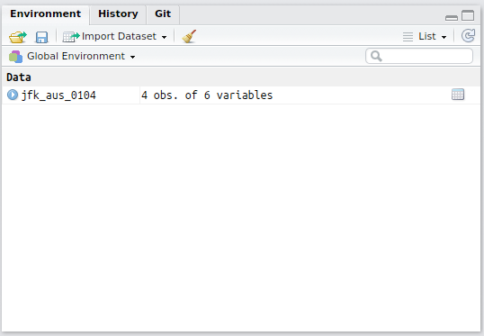

```{r setup, include=FALSE}

options(htmltools.dir.version = FALSE)

rm(list = ls())

library(tidyverse)
library(nycflights13)
library(gridExtra)
library(Cairo)
library(grDevices)


```

```{r download-remark-bib, include=FALSE}

# xaringan::summon_remark(version = "latest", to = "remark-lib/")

```

```{r make-pdf, message=FALSE, warning=FALSE, include=FALSE}

## print slides as PDF document

# system("~/decktape-1.0.0/phantomjs ~/decktape-1.0.0/decktape.js ~/R/R-tistic/aCourses/02-data-visualisation.html ~/R/R-tistic/aCourses/02-data-visualisation.pdf")


```

layout: true
class: theme

---
class: inverse, middle, center

.superlarge[Overview]

---
## R-tistic
***
### Overview

1. Introduction to R and RStudio
    - basics of data visualisation 
    - basics of reproducible research
2. Basics of data manipulation
    - using Slack for class communication
    - data manipulation with dplyr
3. Basics of using R for statistical analyses
4. Basics of Git, GitHub and collaborative programming
5. Advanced classes of the above

---
## R-tistic
***
### Overview

1. Introduction to R and RStudio
    - basics of data visualisation 
    - basics of reproducible research
2. Basics of data manipulation
    - using Slack for class communication
    - **data manipulation with dplyr**
3. Basics of using R for statistical analyses
4. Basics of Git, GitHub and collaborative programming
5. Advanced classes of the above

---
## R-tistic
***
### Overview

1. Introduction to R and RStudio
    - basics of data visualisation 
    - basics of reproducible research
2. Basics of data manipulation
    - using Slack for class communication
    - **data manipulation with dplyr**
3. Basics of data wrangling
    - **data import with readr**
    - **data wrangling with tidyr**
4. Basics of RMarkdown
    - **write a report with RMarkdown**
5. Basics of using R for statistical analyses
6. Basics of Git, GitHub and collaborative programming
7. Advanced classes of the above

---
class: inverse, middle, center

.superlarge[Recapitulation]

---
## Recap
***

.pull-left[What have you worked on between the last class (15.06.2017) and today?

]

.footnote[
Images taken from [https://giphy.com/](https://giphy.com/)
]

--

.pull-right[Who is willing to use **Slack** for class communication?


]

---
## Recap 
***
### five key dplyr functions

- pick observations by their values with `filter()`
- reorder the rows with `arrange()`
- pick variables (columns) by their names with `select()`
- create new variables with functions of existing variables with `mutate()`

.footnote[
This slide is inspired by content and code directly copied from the book ["R for Data Science"](http://bit.ly/wickham_r4ds) by [Hadley Wickhmam](http://hadley.nz/) available under a [(CC BY-NC-ND 3.0 US)](https://creativecommons.org/licenses/by-nc-nd/3.0/us/) License.
]

---
## Recap
***
### filter observations with filter()

Identify all flights departing from John F Kennedy Intl. Airport **and** with the destination of Austin Bergstrom **and** on April 1st 2013.

```{r, eval = FALSE}

flights %>% 
  filter(
    origin == "JFK",
    dest == "AUS",
    day == 1,
    month == 4
  ) 

```

---
## Recap
***
### select columns (variables) with select()

```{r, eval = FALSE}

flights %>% 
  filter(
    origin == "JFK",
    dest == "AUS",
    day == 1,
    month == 4
  ) %>% 
  select(1:3, origin, dest, time_hour)

```


---
## Recap
***
### Use assignment operator `<-` to save results 

```{r, message=FALSE, warning=FALSE, include=TRUE}

jfk_aus_0104 <- flights %>% 
  filter(
    origin == "JFK",
    dest == "AUS",
    day == 1,
    month == 4
  ) %>% 
  select(1:3, origin, dest, time_hour)

```


---
## Recap
***
### New objects saved in "Global Environment" 



---
## Recap
***
### Reorder rows with arrange()

- changes the order of rows in a data frame instead of selecting them 
- takes a data frame and a column name to order by

```{r, eval=FALSE, message=FALSE, warning=FALSE, include=TRUE}

View(jfk_aus_0104)

```


```{r, echo=FALSE, message=FALSE, warning=FALSE}

knitr::kable(jfk_aus_0104, format = 'html', align = 'c')


```


---
## Recap
***
### Reorder rows with arrange()

- arrange by `time_hour`

```{r, eval=FALSE}

jfk_aus_0104 %>% 
  arrange(time_hour) %>% 
  View()

```

```{r, echo=FALSE, message=FALSE, warning=FALSE}

jfk_aus_0104 %>% 
  arrange(time_hour) %>% 
  knitr::kable(format = 'html', align = 'c')

```


---
## Recap
***
### Reorder rows with arrange()

- arrange by `time_hour` in descending order

```{r, eval=FALSE}

jfk_aus_0104 %>% 
  arrange(desc(time_hour)) %>% 
  View()

```

```{r, echo=FALSE, message=FALSE, warning=FALSE}

jfk_aus_0104 %>% 
  arrange(desc(time_hour)) %>% 
  knitr::kable(format = 'html', align = 'c')

```

---
## Recap
***
### Rename variables with rename()

```{r, eval=FALSE}

jfk_aus_0104 %>% 
  rename(
    Year = year,
    Month = month,
    Day = day,
    Origin = origin,
    Destination = dest,
    this_is_time_and_hour = time_hour
  )

```

```{r, echo=FALSE, message=FALSE, warning=FALSE}

jfk_aus_0104 %>% 
  rename(
    Year = year,
    Month = month,
    Day = day,
    Origin = origin,
    Destination = dest,
    this_is_time_and_hour = time_hour
  ) %>% 
  knitr::kable(format = 'html', align = 'c')

```

---
## Recap
***
### Adding new variables with mutate()

- besides selecting sets of existing variables (columns), it can be useful to add variables (columns)
- these variables are functions of existing variables
- `mutate()` adds new columns add the end of your dataset

.footnote[
This slide is inspired by content and code directly copied from the book ["R for Data Science"](http://bit.ly/wickham_r4ds) by [Hadley Wickhmam](http://hadley.nz/) available under a [(CC BY-NC-ND 3.0 US)](https://creativecommons.org/licenses/by-nc-nd/3.0/us/) License.
]

---
## Recap
***
### Adding new variables with mutate()

First: select smaller dataset with select().

```{r, message=FALSE, warning=FALSE, include=TRUE}

flights_sml <- flights %>% 
  select(year:day, ends_with("delay"), distance,air_time)

```


```{r, echo=FALSE, message=FALSE, warning=FALSE}

flights_sml %>% 
  slice(1:6) %>% 
  knitr::kable(format = 'html', align = 'c')

```

---
## Recap
***
### Adding new variables with mutate()

```{r, message=FALSE, warning=FALSE, include=TRUE, eval=FALSE}

flights_sml %>%
  mutate(
      gain = arr_delay - dep_delay,
      hrs = air_time / 60,
      gain_p_hr = gain / hrs
  )

```

```{r, echo=FALSE}

flights_sml %>%
  slice(1:6) %>% 
  mutate(
      gain = arr_delay - dep_delay,
      hrs = air_time / 60,
      gain_p_hr = gain / hrs
  ) %>% 
  knitr::kable(format = 'html', align = 'c', digits = 1)

```


---
class: inverse, middle, center

.superlarge[Back to dplyr]

---
## Basics of Data Manipulation
***
### five key dplyr functions

- pick observations by their values with `filter()`
- reorder the rows with `arrange()`
- pick variables (columns) by their names with `select()`
- create new variables with functions of existing variables with `mutate()`

.footnote[
This slide is inspired by content and code directly copied from the book ["R for Data Science"](http://bit.ly/wickham_r4ds) by [Hadley Wickhmam](http://hadley.nz/) available under a [(CC BY-NC-ND 3.0 US)](https://creativecommons.org/licenses/by-nc-nd/3.0/us/) License.
]

---
## Basics of Data Manipulation
***
### five key dplyr functions

- pick observations by their values with `filter()`
- reorder the rows with `arrange()`
- pick variables (columns) by their names with `select()`
- create new variables with functions of existing variables with `mutate()`
- collapse many values down to a single summary with `summarise()`

--

These can be used in conjunction with `group_by`, which changes the scope of each function from operating on the entire dataset to operating on it group-by-group.

.footnote[
This slide is inspired by content and code directly copied from the book ["R for Data Science"](http://bit.ly/wickham_r4ds) by [Hadley Wickhmam](http://hadley.nz/) available under a [(CC BY-NC-ND 3.0 US)](https://creativecommons.org/licenses/by-nc-nd/3.0/us/) License.
]

---
class: inverse, middle, center

.superlarge[Grouped summaries with dplyr summarise()]

---
## summarise()
***
### Description

- collapses a data frame to a single row 

```{r, eval=FALSE, include=TRUE}

flights %>% 
  summarise(
    delay = mean(dep_delay, na.rm = TRUE)
  )

```

--

```{r, echo=FALSE}

flights %>% 
  summarise(
    delay = mean(dep_delay, na.rm = TRUE)
  )

```

- is that a useful result?

.footnote[
This slide is inspired by content and code directly copied from the book ["R for Data Science"](http://bit.ly/wickham_r4ds) by [Hadley Wickhmam](http://hadley.nz/) available under a [(CC BY-NC-ND 3.0 US)](https://creativecommons.org/licenses/by-nc-nd/3.0/us/) License.
]

---
## summarise()
***
### Description

- why do we not get a result?

```{r, eval=FALSE, include=TRUE}

flights %>% 
  summarise(
    delay = mean(dep_delay)
  )

```


```{r, echo=FALSE}

flights %>% 
  summarise(
    delay = mean(dep_delay)
  )

```

- use `na.rm = TRUE` to exclude observarions with `NA` from calculation of `mean()`

.footnote[
This slide is inspired by content and code directly copied from the book ["R for Data Science"](http://bit.ly/wickham_r4ds) by [Hadley Wickhmam](http://hadley.nz/) available under a [(CC BY-NC-ND 3.0 US)](https://creativecommons.org/licenses/by-nc-nd/3.0/us/) License.
]

---
## summarise()
***
### mean()

- what does mean() do?

--

```{r, eval=TRUE, include=FALSE}

r_tistic <- tibble(
  participant = c("Nienke", "Natalie", "Bernadette", "Moritz", "Imanol", "Lars"),
  status = c("student", "student", "student", "student", "student", "teacher"),
  age = c(27, 27, 27, 30, 29, 30)
)

```

```{r, echo=FALSE}

knitr::kable(r_tistic, format = 'html', align = 'c')

```

--

- `sum(age) = 27 + 27 + 27 + 30 + 29 + 30 = 170`
- `n() = 6`
- `mean(age) = sum(age) / n()` 
- `mean(age) = 170 / 6  = 28.33`


---
## summarise()
***
### mean()

- what does mean() do?

```{r, eval=FALSE, include=TRUE}

r_tistic %>%
  summarise(
    sum_age = sum(age),
    count = n(),
    mean_age_1 = sum(age)/n(),
    mean_age_2 = sum_age/count,
    mean_age_3 = mean(age)
  )

```

```{r, echo=FALSE}

r_tistic %>%
  summarise(
    sum_age = sum(age),
    count = n(),
    mean_age_1 = sum(age)/n(),
    mean_age_2 = sum_age/count,
    mean_age_3 = mean(age)
  ) %>% 
  knitr::kable(format = 'html', digits = 2, align = 'c')

```

---
## summarise()
***
### paired with group_by()

- what does `sd()` do?

```{r, eval=FALSE, include=TRUE}

r_tistic %>%
  group_by(status) %>% 
  summarise(
    sum_age = sum(age),
    count = n(),
    mean_age = mean(age),
    sd_age = sd(age)
  )

```

```{r, echo=FALSE}

r_tistic %>%
  group_by(status) %>% 
  summarise(
    sum_age = sum(age),
    count = n(),
    mean_age = mean(age),
    sd_age = sd(age)
  ) %>% 
  knitr::kable(format = 'html', digits = 2, align = 'c')

```

---
## A bit of math
***
### sd()


- what does sd() do?

--

- who can explain how the standard deviation is computed?

--

> The standard deviation is computed by taking the square root of the mean of the squared deviations of the individual values from their mean value.

--

- what does that mean?

---
## Standard deviation
***
### R-tistic participants

- calculate the mean of all values

```{r, echo=FALSE}

knitr::kable(r_tistic, format = 'html', align = 'c')

```

`mean(age) = 27 + 27 + 27 + 30 + 29 + 30 / 6  = 28.33`

---
## Standard deviation
***
### R-tistic participants

- calculate deviation of each data point from the mean (28.33)

```{r, echo=FALSE}

r_tistic %>% 
  mutate(
    dev_from_mean = (age - mean(age))
  ) %>% 
  knitr::kable(format = 'html', align = 'c', digits = 2)
  

```

`dev_from_mean = (27 - 28.33), (27 - 28.33), (27 - 28.33), (30 - 28.33), (29 - 28.33), (30 - 28.33)`

---
## Standard deviation
***
### R-tistic participants

- calculate deviation of each data point from the mean (28.33)
- square the result of each

```{r, echo=FALSE}

r_tistic %>% 
  mutate(
    dev_fr_mean = (age - mean(age)), 
    dev_fr_mean_sqr = (age - mean(age))^2
  ) %>% 
  knitr::kable(format = 'html', align = 'c', digits = 2)
  
```

---
## Standard deviation
***

- the variance is the mean of these values

```{r, echo=FALSE}

r_tistic %>% 
  mutate(
    dev_fr_mean = (age - mean(age)), 
    dev_fr_mean_sqr = (age - mean(age))^2
  ) %>% 
  knitr::kable(format = 'html', align = 'c', digits = 2)

```

`var(age) = sum(dev_fr_mean_sqr) / (n() - 1)` 
`sum(dev_fr_mean_sqr) = 1.78 + 1.78 + 1.78 + 2.78 + 0.44 + 2.78 = 11.34`  
`n() = 5`  
`var(age) = 11.34 / 5 = 2.26`

---
## Standard deviation
***

- the variance is the mean of these values
- the standard deviation is the squareroot of the variance

```{r, echo=FALSE}

r_tistic %>% 
  mutate(
    dev_fr_mean = (age - mean(age)), 
    dev_fr_mean_sqr = (age - mean(age))^2
  ) %>% 
  knitr::kable(format = 'html', align = 'c', digits = 2)

```

`sd(age) = sqrt(var(age))`  
`var(age) = 2.26`  
`sd(age) = sqrt(2.26) = 1.51`

---
## Standard deviation
***

```{r, eval=FALSE, include=TRUE}

r_tistic %>% 
  summarise(
    mean_age = mean(age),
    var_age = var(age),
    sd_age = sd(age),
    sd_age_2 = sqrt(var_age),
    sd_age_3 = sqrt(sum((age - mean(age))^2)/(n() - 1))
  )


```

```{r, echo=FALSE}

r_tistic %>% 
  summarise(
    mean_age = mean(age),
    var_age = var(age),
    sd_age = sd(age),
    sd_age_2 = sqrt(var_age),
    sd_age_3 = sqrt(sum((age - mean(age))^2)/(n() - 1))
  ) %>% 
  knitr::kable(format = 'html', align = 'c', digits = 2)


```

--

- why "n() - 1"?
- it's all about "Sample variance" vs. "Population variance"
- know as "Bessel's correction", if interested to learn more, follow link below

.footnote[[http://bit.ly/2ucjZTr](Bessel's Correction)]

---
class: inverse, middle, center

.superlarge[Enough math, or?]

---
## Exercise 
***

1. Use the flights dataset and per destination, calculate:
  - the count
  - the mean of the distance
  - the mean of the arrival delay
  - save the dataframe as a new object to your environment
2. Use the created object to manipulate the data, so that it shows only those observations with
  - a count higher than 20
  - that is not the destination "Honolulu Intl"
  - save the manipulated dataframe as a new object to your environment
3. Use the second created object and plot:
  - the mean arrival delay over the mean distance
  - add a smoother
4. Visualise the number of observations (count) per destination

---
## Part 1
***

- Use the flights dataset and per destination, calculate:
  - the count
  - the mean of the distance
  - the mean of the arrival delay
  - save the dataframe as a new object to your environment
  
```{r}

flights_summary <- flights %>% 
  group_by(dest) %>%
  summarise(
    count = n(),
    mean_dist = mean(distance, na.rm = TRUE),
    mean_delay = mean(arr_delay, na.rm = TRUE)
  )

```

---
## Part 2
***

- Use the created object to manipulate the data, so that it shows only those observations with:
  - a count higher than 20
  - that is not the destination "Honolulu Intl"
  - save the manipulated dataframe as a new object to your environment

```{r}

flights_summary_filter <- flights_summary  %>%
  filter(count > 20, dest != "HNL") 

```

---
## Part 3
***

- Use the second created object and plot:
  - the mean arrival delay over the mean distance
  - add a smoother
  
```{r flights-1, echo=FALSE, fig.height=4, fig.width=9, message=FALSE, warning=FALSE, cache=TRUE, dev='CairoSVG'}

ggplot(data = flights_summary_filter, mapping = aes(x = mean_dist, y = mean_delay)) +
  geom_point() +
  geom_smooth(se = FALSE) +
  theme_bw(base_size = 18)

```

---
## Part 3
***

- Use the second created object and plot:
  - the mean arrival delay over the mean distance
  - add a smoother
  
```{r, echo = TRUE, eval = FALSE, message=FALSE, warning=FALSE}

ggplot(
  data = flights_summary_filter, 
  mapping = aes(x = mean_dist, y = mean_delay)
       ) +
  geom_point() +
  geom_smooth(se = FALSE) +
  theme_bw(base_size = 18)


```


---
## Part 4
***

- Visualise the number of observations (count) per destination

```{r flights-2, echo=FALSE, fig.height=4, fig.width=9, message=FALSE, warning=FALSE, cache=TRUE, dev='CairoSVG'}

ggplot(data = flights_summary_filter, mapping = aes(x = mean_dist, y = mean_delay)) +
  geom_point(aes(size = count)) +
  geom_smooth(se = FALSE) +
  theme_bw(base_size = 18)


```

---
## Part 4
***

- Visualise the number of observations (count) per destination

```{r, echo = TRUE, eval = FALSE, message=FALSE, warning=FALSE}

ggplot(
  data = flights_summary_filter, 
  mapping = aes(x = mean_dist, y = mean_delay)
  ) +
  geom_point(aes(size = count)) +
  geom_smooth(se = FALSE) +
  theme_bw(base_size = 18)


```

---
## Part 4.1
***

- Improve the visibility of individual points

```{r flights-3, echo=FALSE, fig.height=4, fig.width=9, message=FALSE, warning=FALSE, cache=TRUE, dev='CairoSVG'}

ggplot(data = flights_summary_filter, mapping = aes(x = mean_dist, y = mean_delay)) +
  geom_point(aes(size = count), alpha = 1/3) +
  geom_smooth(se = FALSE) +
  theme_bw(base_size = 18)


```

---
## Part 4.1
***

- Improve the visibility of individual points

```{r, echo = TRUE, eval = FALSE, message=FALSE, warning=FALSE}

ggplot(
  data = flights_summary_filter, 
  mapping = aes(x = mean_dist, y = mean_delay)
  ) +
  geom_point(aes(size = count), alpha = 1/3) +
  geom_smooth(se = FALSE) +
  theme_bw(base_size = 18)


```

---
## Grouping by multiple variables
***

When you group by multiple variables, each summary peels off one level of the grouping. That makes it easy to progressively roll up a dataset:

```{r, echo = TRUE, eval = FALSE, message=FALSE, warning=FALSE}

flights %>% 
  group_by(year, month, day) %>% 
  summarise(
    flights = n()
  )

```

--

```{r, echo=FALSE}

daily <- flights %>% 
  group_by(year, month, day) %>% 
  summarise(
    flights = n()
  )

knitr::kable(head(daily), format = 'html', align = 'c')

```

---
## Grouping by multiple variables
***

- and per month

```{r, echo = TRUE, eval = FALSE, message=FALSE, warning=FALSE}

flights %>% 
  group_by(year, month, day) %>% 
  summarise(
    flights = n()
  ) %>% 
  summarise(flights = sum(flights)))

```

```{r, echo=FALSE}

monthly <- flights %>% 
  group_by(year, month, day) %>% 
  summarise(
    flights = n()
  ) %>% 
  summarise(flights = sum(flights))

knitr::kable(head(monthly), format = 'html', align = 'c')

```


---
class: inverse, middle, center

.superlarge[
Import your data with readr
]

---
## The "read_*" functions
***

- read_csv() reads comma delimited files, which is one of the most common forms of data storage
- read_csv2() reads semicolon separated files (common in countries where , is used as the decimal place), 
- read_tsv() reads tab delimited files, 
- and read_delim() reads in files with any delimiter.

---
class: inverse, middle, center

.large[Who likes Star Wars?]


--


.footnote[
Image taken from [https://giphy.com/](https://giphy.com/)
]

---
## Star Wars
***
### Explore dataset


