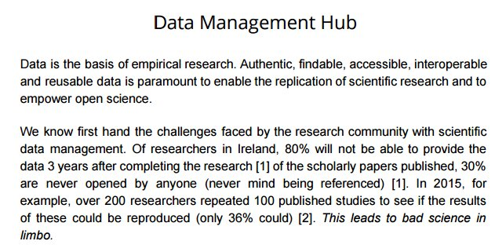

# Publications

## Reproducible research

[nature publication](http://go.nature.com/2jm3QSx)

[Book: The Practice of Reproducible Research](https://www.practicereproducibleresearch.org)

> This book contains a collection of 31 case studies of reproducible research workflows, written by academic researchers in the data-intensive sciences. Each case study describes how the author combined specific tools, ideas, and practices in order to complete a real-world research project. Emphasis is placed on the practical aspects of how the author organized his or her research to make it as reproducible as possible.

(https://twitter.com/KubrikHQ/status/843764208252653569/photo/1)

[Data managemant hub](https://twitter.com/DaMaHub)
[Video- data management hub](https://www.youtube.com/watch?v=MYFyr2NmWdg)

[Remake for reproducible workflows](https://github.com/richfitz/remake)

[Crouchers Law - You can be an idiot - Slides](https://mikecroucher.github.io/MLPM_talk/)

[Walking Randomly Blog - Is your research software correct?](http://www.walkingrandomly.com/?p=5825)

[Fernando Perez](http://blog.fperez.org/2013/04/literate-computing-and-computational.html)

[Is most published research wrong?](https://www.youtube.com/watch?v=42QuXLucH3Q)

[Getting started with the Open Science Framework](https://www.youtube.com/watch?v=2TV21gOzfhw)

[Estimating the reproducibility of psychological science](http://science.sciencemag.org/content/349/6251/aac4716)

[ReportR package](https://mran.microsoft.com/package/ReporteRs/)

### Git 

[Slides - Git for Humans](https://speakerdeck.com/alicebartlett/git-for-humans)

### Literate Programming

### R Markdown

[knitr/rmarkdown/Latex: How to cross-reference figures and tables?](http://stackoverflow.com/questions/38861041/knitr-rmarkdown-latex-how-to-cross-reference-figures-and-tables)

[Use R Markdown with Zotero](https://github.com/bbest/rmarkdown-example)
[From endnote to Zotero](https://www.zotero.org/support/kb/importing_records_from_endnote#exporting_your_library_from_endnote)

[Make your docs look pretty with prettydoc](https://yixuan.cos.name/prettydoc/themes.html)

[CSS stylesheets for R Markdown](http://mixu.net/markdown-styles/#thomasf-solarizedcssdark)

### Make and remake

[Make-like build management, reimagined for R.](https://github.com/richfitz/remake/blob/master/README.md)

## Graphics

[Cleveland, McGill (1984) -Graphical Perception: Theory, Experimentation, and Application to the Development of Graphical Methods](https://www.jstor.org/stable/2288400?seq=1#page_scan_tab_contents)

[R animated GIFs](http://lenkiefer.com/2016/05/29/improving-R-animated-gifs-with-tweenr?utm_content=buffer76d56&utm_medium=social&utm_source=twitter.com&utm_campaign=buffer)

[A Compendium of Clean Graphs in R](http://shinyapps.org/apps/RGraphCompendium/index.php?utm_content=buffer831bc&utm_medium=social&utm_source=twitter.com&utm_campaign=buffer) 

# Random collection of hyperlinks

## R and R Studio Intro

[Basic but good](http://bit.ly/2jg8DF4)
[Lesson and course overview by Software Carpentry](https://swcarpentry.github.io/r-novice-gapminder/)

## R packages 

[Excellent collection](https://github.com/qinwf/awesome-R)

## R Markdown

[RStudio Blogpost 2014. R Markdown v2, talk by Yihui](https://blog.rstudio.org/2014/06/18/r-markdown-v2/)

[How to Write Faster, Better & Longer: The Ultimate Guide to Markdown](https://blog.ghost.org/markdown/)

[Jupyter And R Markdown: Notebooks With R](https://www.datacamp.com/community/blog/jupyter-notebook-r#markdown)

## Basic stats

[How to Interpret a Regression Model with Low R-squared and Low P values](http://bit.ly/2jV8kjX)
[What statistical analysis should I use?](http://bit.ly/2iK1rVx)
[Learn some stats](https://www.wikidata.org/w/api.php?action=help&modules=main)
[This is the best](http://students.brown.edu/seeing-theory/)

[Correlation Matrix - A quick start guide](http://www.sthda.com/english/wiki/correlation-matrix-a-quick-start-guide-to-analyze-format-and-visualize-a-correlation-matrix-using-r-software?utm_content=buffer8f424&utm_medium=social&utm_source=plus.google.com&utm_campaign=buffer)

[Model Validation - Interpreting residual plots](http://quantitativeecology.blogspot.ch/2011/07/model-validation-interpreting-residual.html)

[Correlation, coefficient explained graphically](http://janhove.github.io/teaching/2016/11/21/what-correlations-look-like)

## Advanced stats

[PCA in R](https://www.r-bloggers.com/principal-component-analysis-in-r/amp/)

[10+2 Data Science Methods that Every Data Scientist Should Know in 2016](http://tjo-en.hatenablog.com/entry/2016/04/18/190000)
## Experimental design

[3ie Working Paper 26:Power calculation for causal inference in social science: sample size and minimum detectable effect determination](http://bit.ly/2jHzrBu)

[Paper - Three points to consider LM or GLM](http://onlinelibrary.wiley.com/doi/10.1111/2041-210X.12552/abstract)

[Book - applied predictive moddeling](http://appliedpredictivemodeling.com)

## Functions

[Intro to functions, idre, UCLA](http://bit.ly/2jV8kjX)

## Datavis

[Data visualisation catalogue](http://bit.ly/2jVa6RT)

[430 data visulisation tools...](https://keshif.me/demo/VisTools)

[Visualising distributions](http://www.darkhorseanalytics.com/blog/visualizing-distributions-3?es_p=3278620)

## Visualising residuals

[residuals](https://drsimonj.svbtle.com/visualising-residuals?utm_content=bufferbe7ab&utm_medium=social&utm_source=twitter.com&utm_campaign=buffer)

## Fovethiryeight repo

[fivethirtyeight data repo](https://github.com/fivethirtyeight/data)

## ggraph

[ggraph](https://www.wikidata.org/w/api.php?action=help&modules=main)

[Scientific Journal and Sci-Fi Themed Color Palettes for ggplot2 (e.g. the Simpsons!)](http://bit.ly/2k8KRL9)

## Data mining

[The World Bank Data Catalogue](http://bit.ly/2iT49TQ)  
[rOpenSci Community](http://bit.ly/2kh46qg)  
[www.datazar.com/](www.datazar.com/)  
[Stats SA](http://www.statssa.gov.za)  
[Stats SA - Access to information manual](http://www.statssa.gov.za/wp-content/uploads/2013/07/Access_to_information.pdf) 
[Basic Boolean Operators explained](http://booleanblackbelt.com/2008/12/basic-boolean-search-operators-and-query-modifiers-explained/)  
[ArcGis opendata](https://blogs.esri.com/esri/arcgis/2016/11/08/whats-new-in-open-data-november-2016/)  
[Twitter](https://github.com/mkearney/rtweet/blob/master/README.md)
[Global Consumption Database](http://datatopics.worldbank.org/consumption/?CID=DEC_TT_data_EN_EXT)
[Wikidata](https://www.wikidata.org/wiki/Wikidata:Main_Page)

[Our world in Data package](https://drsimonj.svbtle.com/ourworld-an-r-data-package)

[SwissAir: Air Quality Data of Switzerland for one year in 30 min Resolution](https://cran.r-project.org/web/packages/SwissAir/index.html)

## TeX

[The MacTeX-2016 Distribution](http://bit.ly/2jHI13u)

$$
\sum_{i=1}^NX_i + Y_i - Z
$$

## RStudio

[R Cheatsheets](http://bit.ly/2kfDOk3)

## Books

[Sanjoy Mahajan - Street-fighting mathematics](http://bit.ly/2jHvahq)
[A Student's Guide to Data and Error Analysis, Cambridge](http://bit.ly/2iTaGOo)
[Signal - Understanding what matters](https://www.perceptualedge.com/library.php#Books)

## e-learning

[Sanjoy Mahajan - Street-fighting mathematics](http://bit.ly/2iJTnnP)
[HarvardX: PH525.1x Data Analysis for Life Sciences 1: Statistics and R](http://bit.ly/2jxkGif)
[Microsoft: DAT204x Introduction to R for Data Science](http://bit.ly/2j2v572)

[Slack](http://www.nature.com/news/how-scientists-use-slack-1.21228?WT.mc_id=TWT_NatureNews)

# People to follow

## If on twitter

[Yihui Xie (@xieyihui)](http://bit.ly/2jNj8Ty)

## If not on twitter (...)

[Yihui Xie](http://bit.ly/2jFlRw5)

## R Projects 

[rOpenSci Community](http://bit.ly/2kh46qg)

>*rOpenSci is entirely a community driven effort. The project originally came together from conversations between like-minded researchers and continues to expand as more people contribute tools, expertise, and research ideas.* - taken from: http://ropensci.org/community/ (22.01.2017)

## Great vis

[Thematic maps with ggplot2 - Switzerland](https://timogrossenbacher.ch/2016/12/beautiful-thematic-maps-with-ggplot2-only/)

## Other language

[Julia. Medium Post](https://medium.com/@ivydatascience/julia-and-its-usefulness-in-data-science-6e9181504ff4#.t0chjcw3c)
[Book Review: Julia for Data Science by Zacharias Voulgaris, Ph.D.](http://insidebigdata.com/2017/01/10/book-review-julia-data-science/)

[Data Science, Machine Learning, Artificial Intelligence, Big Data, and IoT Resources](https://github.com/acastrounis/data-science-machine-learning-ai-big-data-iot-resources/blob/master/README.md)

## Workshops

[Elements of a successful #openscience #rstats workshop](https://www.r-bloggers.com/elements-of-a-successful-openscience-rstats-workshop/amp/)

# Publishing

## Blogdown

[Making websites with R Markdown...](https://slides.yihui.name/2017-rstudio-conf-blogdown-Yihui-Xie.html?utm_content=buffer96d21&utm_medium=social&utm_source=twitter.com&utm_campaign=buffer#1)

[...and Hugo](https://gohugo.io)

## WorkflowR

[package on github](https://github.com/jdblischak/workflowr)

# Blogs / Podcasts

[Data Blog by ETH Zurich](https://www.explora.ethz.ch/en/s/surfing-the-sea-of-data/)
[Reproducible websites](http://www.the100.ci/2017/02/19/reproducible-websites-for-fun-and-profit/#comment-59)
[Jon Zelner: Make Files](http://www.jonzelner.net/statistics/make/docker/reproducibility/2016/05/31/reproducibility-pt-1/)

# Code

## Style Guide

[Writing Good R Code and Writing Well](https://www.rstudio.com/rviews/2016/12/02/writing-good-r-code-and-writing-well/)

[Hadley Wickham Style Guide](http://adv-r.had.co.nz/Style.html)
[Sharing R Code  - with Style](http://handsondatascience.com/StyleO.pdf)
[Graham Williams, Director Data Science, Microsoft - sharing code with style](http://blog.revolutionanalytics.com/2016/10/sharing-r-code-with-style.html)

[R package - formatR](https://yihui.name/formatr/)

# Random

[DT - Datatable package to interactively look at data in html document](https://rstudio.github.io/DT/)

[RMarkdown Output HTML templates](https://github.com/juba/rmdformats)

[Sankey Diagrams](https://blog.ouseful.info/2017/03/17/experimenting-with-sankey-diagrams-in-r-and-python/?utm_content=bufferb07fa&utm_medium=social&utm_source=twitter.com&utm_campaign=buffer)
[NetworkD3 for Sankey](http://christophergandrud.github.io/networkD3/)

[Shiny and leaflet](https://www.r-bloggers.com/4-tricks-for-working-with-r-leaflet-and-shiny/amp/)

# Hadley Videos

[Expressing yourself in R](https://www.youtube.com/watch?v=1POb5fx_m3I)

[Data Science in the tidyverse](https://www.rstudio.com/resources/videos/data-science-in-the-tidyverse/)

# dplyr

[lesser known dplyr tricks](http://www.brodrigues.co/blog/2017-02-17-lesser_known_tricks/)

[learn about the case_when function](https://rud.is/b/2017/03/10/making-a-case-for-case_when/)

# tidyr

[Tidy data collection in Excel](http://www.chi2innovations.com/blog/discover-data-blog-series/11-essential-tips-effective-data-collection/?utm_medium=social&utm_campaign=postplanner&utm_source=twitter.com)

# purrr

[purrr tutorial](https://jennybc.github.io/purrr-tutorial/index.html)

# Databaseses

## MongoDB / mongolite

[Using mongoDB with R](https://datascienceplus.com/using-mongodb-with-r/)

# Metadata

[GRID - Global Research Identifier Database](https://datascienceplus.com/using-mongodb-with-r/)

# D3

[D3 annotation](http://d3-annotation.susielu.com)

# Email Newsletter

[Mailtrain - selfhosted email newsletter](https://mailtrain.org)

# Text mining

[Emoticons in R](http://opiateforthemass.es/articles/emoticons-in-R/?utm_content=buffer56942&utm_medium=social&utm_source=twitter.com&utm_campaign=buffer)

# Building a Shiny App

[Zev Ross Shiny Tutorial](http://zevross.com/blog/2016/04/19/r-powered-web-applications-with-shiny-a-tutorial-and-cheat-sheet-with-40-example-apps/)

This tutorial is brilliant. In total it took me XX hours to reproduce all the examples in an .Rmd file, which is accessible here: [XXX]() and helped me learn how to build Shiny apps.

# Build a website

[Using blogdown, Hugo and GitHub pages](https://proquestionasker.github.io/blog/Making_Site/)

# ggplot

[GGally - Extensions to ggplot2](http://ggobi.github.io/ggally/#ggally)

[registered ggplot2 extensions](http://www.ggplot2-exts.org/gallery/)

# ggvis

[ggvis 0.4 overview](http://ggvis.rstudio.com)

# forcats

[deal with factors with forcats and gapminder](http://stat545.com/block029_factors.html#load-tidyverse-forcats-gapminder)

# Online literature research

[ropensci fulltext package - search across and get full text for open access journals](https://github.com/ropensci/fulltext)

# Data Driven Documents

[d3js official website](https://d3js.org)

# Dropdown menus in R Markdown

[Kyle Walker - bsselectR](https://walkerke.github.io/2016/12/rmd-dropdowns/)

# Maps Maps Maps

[rMaps](http://rmaps.github.io)

# Free Books made with bookdown

[plotly for R - Carson Sievert](https://cpsievert.github.io/plotly_book/)

# Intro to Docker

[Intro to docker via Rocker](https://github.com/BillMills/Rocker-tutorial)

# Spatial Analysis

[Maps and data vis with R - Spatial.ly](http://spatial.ly/r/)
[leaflet for R](https://rstudio.github.io/leaflet/)
[interactive maps with R](http://rmaps.github.io)

# Blogs

[BHASKAR KARAMBELKAR'S BLOG](https://www.karambelkar.info)

[Data processing workflow by ZevRoss](http://zevross.com/blog/2015/01/13/a-new-data-processing-workflow-for-r-dplyr-magrittr-tidyr-ggplot2/?utm_content=bufferd51d0&utm_medium=social&utm_source=twitter.com&utm_campaign=buffer)

# Asking for help

[Stack Overflow - How to create a Minimal, Complete, and Verifiable example](http://stackoverflow.com/help/mcve)

# Handsondatascience

[good website with many resources](https://togaware.com/onepager/)

# Data mining/collection

[Resources to find the data you need](http://flowingdata.com/2016/11/10/find-the-data-you-need-2016-edition/?utm_content=buffer7be2a&utm_medium=social&utm_source=twitter.com&utm_campaign=buffer)

# ddj (data driven journalims)

[Hand-curated, high quality resources for doing data journalism with R.](https://rddj.info)

[Alberto Cairo Data Journalims MOOC](http://journalismcourses.org/DES17.html)

# explore packages

[gsub](https://analytics4all.org/2016/11/14/r-gsub/)

# R teaching material

[Teaching Material Repo](http://lgatto.github.io/TeachingMaterial/)

# Data from Google sheets

[Reading data from google sheets into R](http://bit.ly/2kwIEtk)
